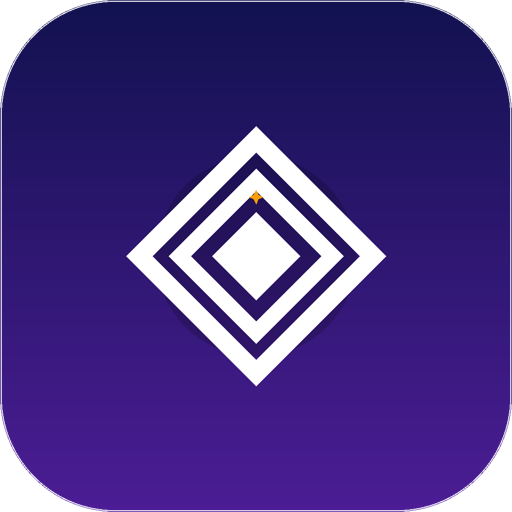
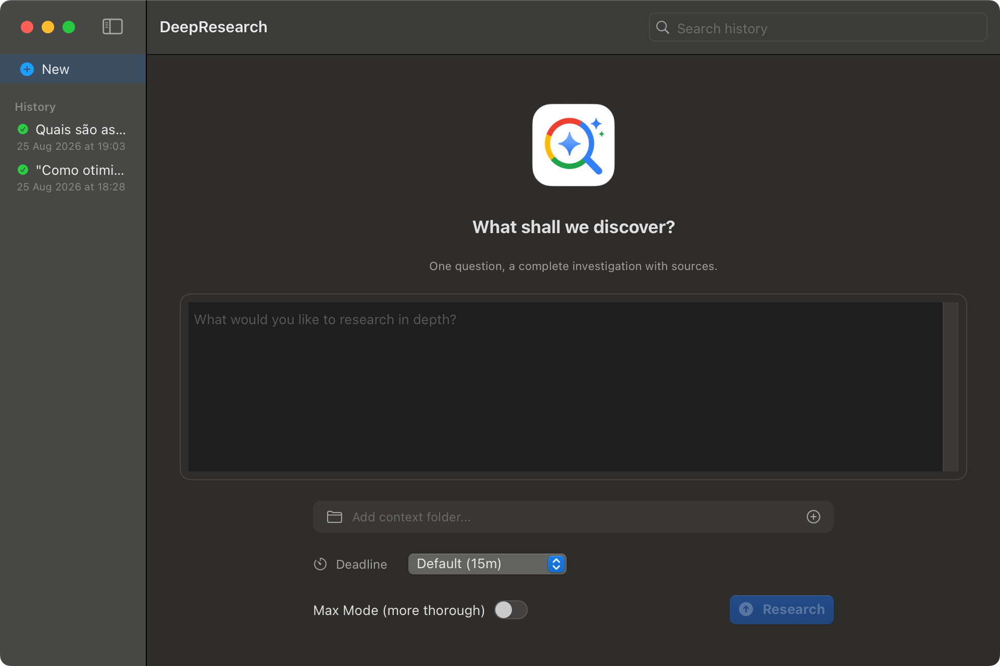

# DeepResearch

A native macOS app for deep, source-backed research powered by Google's Gemini Deep Research Interactions API. Ask a question, and DeepResearch runs a full investigation — planning, searching, synthesizing — with live streaming progress and a final report you can copy or export.


[](screenshots/main.png)

## Download

Build locally (no paid Apple Developer account required):

```bash
./install.sh    # build release + install → /Applications/DeepResearch.app
```

or run straight from the source tree:

```bash
swift run DeepResearch    # development mode, no app bundle
```

## First launch (macOS 15+)

The release build is **not notarized** — notarization requires a paid Apple Developer account — so macOS blocks the first launch. Since macOS 15 (Sequoia) the old right-click → Open bypass is **gone**, so use this flow instead:

1. Double-click `DeepResearch.app` → the dialog says it can't be opened → click **Done**.
2. Open **System Settings → Privacy & Security → Security** (scroll to the bottom).
3. Under "Allow applications from", find *"DeepResearch was blocked to protect your Mac"* → click **Open Anyway** → confirm with your password.
4. Launch DeepResearch normally from now on.

> **Tip:** `Open Anyway` only appears for ~1 hour after the blocked launch. If you don't see it, double-click the app once more and go straight back to System Settings.
>
> **Troubleshooting:** if macOS claims the app is "damaged", remove the quarantine attribute once:
>
> ```bash
> xattr -dr com.apple.quarantine /Applications/DeepResearch.app
> ```

**Prefer to skip all of this?** Build locally — a `swift build` output never receives the quarantine attribute, so Gatekeeper stays out of the way (requires only the Xcode Command Line Tools).

## How to use

1. Build and install: `./install.sh` (or `swift run DeepResearch` for development).
2. Open DeepResearch — the main window shows a sidebar with research history.
3. Click **New Research** and type your question.
4. Optionally toggle **Max Mode** for a more thorough investigation.
5. Watch the live log as the research progresses through phases: Planning → Researching → Writing.
6. When complete, read the full report inline with images and sources.
7. Copy the report as Markdown or export it as a `.md` file with images.

## Major features

- **Live streaming progress** — SSE with automatic fallback to polling for reliability.
- **Named phase trail** — Planning → Researching → Writing shown in the log view.
- **Inline report** — rendered Markdown with images, completed-in banner.
- **Copy & Export** — copy Markdown to clipboard, or export `.md` + images to a folder.
- **Multiple concurrent researches** — run several investigations in parallel.
- **Dock badge** — active research count shown on the Dock icon.
- **Notifications** — post on completion/failure/cancellation when the app is in the background.
- **Search history** — all past researches stored locally with full-text search.
- **Menu bar ready** — architecture prepared for popover (planned).
- **Cmd+K palette** — quick access planned.
- **Native SwiftUI** — zero dependencies, Swift 6, macOS 15+, SwiftData.

## Architecture

```
Sources/DeepResearch/
├── App/              # App entry + PresenceManager (Dock + notifications)
├── Core/             # InteractionsClient (API), ResearchCoordinator, SSEEvent
├── Models/           # SwiftData models (ResearchSession, Step, Content)
├── Views/            # SwiftUI views (AppShell, Sidebar, LiveLog, Report, NewResearch)
├── Support/          # ExportService (markdown + image export)
└── Resources/        # Localizable.xcstrings (English)
```

## Configuration

DeepResearch uses the Gemini Deep Research Interactions API. Your API key is stored in `~/.local/share/opencode/auth.json` and read automatically at launch — no manual setup required.

The research sessions are stored locally in `~/Library/Application Support/local.issoeocio.DeepResearch/DeepResearch.sqlite`.

## Pricing

DeepResearch is free and always will be. Every feature is included — live streaming, concurrent researches, export, notifications. No license keys, no accounts, no telemetry.

## History

**1.0.0** — First version: API client with SSE streaming and polling fallback, coordinator with full lifecycle management, sidebar with search, live log with phase trail, report view with inline images, copy/export, Dock badge, notifications, English localization.

## License

DeepResearch is released under the [MIT License](LICENSE).

---

Built with [opencode](https://opencode.ai) — the open-source AI coding agent.
